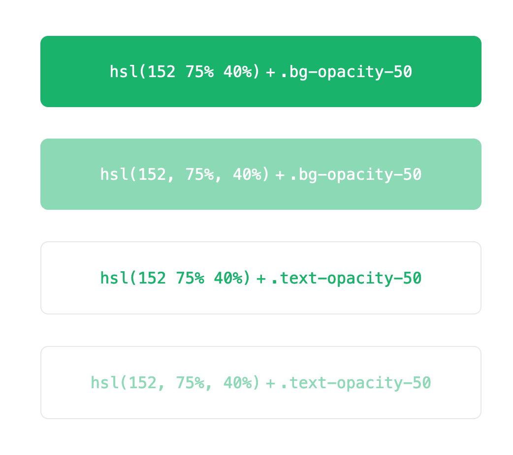

## Tailwind HSL Issue

> Repo created for [tailwindlabs/tailwindcss#4677](https://github.com/tailwindlabs/tailwindcss/issues/4677)

Colors that are defined in tailwind.config.js that use [space-separated HSL notation][1] are not handled correctly when used with color modification utilities like `bg-opacity-{n}` or `text-opacity-{n}`.

For example, if I add the same color using the the two notation styles to my config:

- **evergreen-spaces**: `hsl(152 75% 40%)` (uses space-separated HSL notation)
- **evergreen-commas**: `hsl(152, 75%, 40%)` (uses comma-separated HSL notation)

And then I use those colors in conjunction with background and text opacity utilities:

```jsx
export default function Index() {
  return (
    <div className="flex flex-col items-center justify-center min-h-screen space-y-8 text-white max-w-md text-center mx-auto">
      <div className="bg-evergreen-spaces bg-opacity-50 p-6 rounded-lg w-full">
        <code>hsl(152 75% 40%)</code> + <code>.bg-opacity-50</code>
      </div>
      <div className="bg-evergreen-commas bg-opacity-50 p-6 rounded-lg w-full">
        <code>hsl(152, 75%, 40%)</code> + <code>.bg-opacity-50</code>
      </div>
      <div className="text-evergreen-spaces text-opacity-50 p-6 rounded-lg w-full border">
        <code>hsl(152 75% 40%)</code> + <code>.text-opacity-50</code>
      </div>
      <div className="text-evergreen-commas text-opacity-50 p-6 rounded-lg w-full border">
        <code>hsl(152, 75%, 40%)</code> + <code>.text-opacity-50</code>
      </div>
    </div>
  );
}
```

This is the result:



As you can see, the comma-separated HSL values have their opacity changed, while the space-separated HSL values do not change.

Since space-separated HSL values are supported by evergreen browsers, it seems like Tailwind should support them as well.

[1]: https://developer.mozilla.org/en-US/docs/Web/CSS/color_value/hsl()#space-separated_values
